# Hack Collect API
This is the API of Hack Collect. A React app used to post and rate Life Hacks. The live link for the API can be found here: [Hack Collect API](https://pp5-hack-collect-drf-f277d220324f.herokuapp.com/)

The GitHub repository for the frontend can be found here: [Hack Collect React App](https://github.com/CI-Dominik/pp5-hack-collect) 
Link to the website's project board: [Link to the Trello board](https://trello.com/b/Yi2LxF35/hack-collect)

## **IMPORTANT NOTE**
This project was only edited by me, CI-Dominik. While logging into my GitHub account with the Bash console in Visual Studio Code, I used these commands with my private email address by habit.

`git config --global user.name "Dominik Wulf"` 
`git config --global user.email "My private email address"` 
 
The only commits I made with CI-Dominik were for a GitHub board that I later replaced with my Trello board.

## **TABLE OF CONTENTS**

[**DEVELOPMENT GOAL**](#development-goal)

[**AGILE PLANING**](#agile-planing)
* [Epics](#epics)
* [User Stories](#user-stories)

[**API ENDPOINTS**](#api-endpoints)

[**DATABASE**](#database)

[**TECHNOLOGIES**](#technologies)
* [Python](#python)
* [Django REST Framework](#django-rest-framework)
* [Cloudinary](#cloudinary)
* [Visual Studio Code](#visual-studio-code)
* [GitHub](#github)
* [Heroku](#heroku)

[**TESTING**](#testing)

[**DEPLOYMENT**](#deployment)
  * [GitHub](#github-1)
    * [Visual Studio Code connection](#visual-studio-code-connection)
    * [Commit and Push to GitHub](#commit-and-push-to-github)
  * [Heroku](#heroku)
    * [Create a new project](#create-a-new-project)
    * [Naming and region](#naming-and-region)
    * [Config Vars](#config-vars)
    * [GitHub connection](#github-connection)
    * [Deployment](#deployment-1)
    * [Successful deployment](#successful-deployment)

[**CREDITS**](#credits)
* [Flake8 Extension](#flake8-extension)
* [Visual Studio Code](#visual-studio-code-1)
* [YouTube](#youtube)
* [Special thanks](#special-thanks)

---

## **DEVELOPMENT GOAL**
* The goal of the Hack Collect API is to provide all kinds of information for the frontend. With this, people can login, logout, use hacks, comments, follows and profiles to view, update and delete their data.

---

## **AGILE PLANING**
* Here, a list of Epics the backend was part of is displayed. A full list of the implemented features can be found in the [frontend's readme file](https://github.com/CI-Dominik/pp5-hack-collect/blob/main/README.md)

## Epics
* Authentication System
* Hacks
* Single Hack Page
* Profile
* Followers
* Rated Content

---

## **API ENDPOINTS**

### `/`

**Methods**:
  * GET

**Implementation**:
* Used to access the starting page.

 

### `/categories/`

**Methods**:
  * GET
  * POST

**Implementation**:
* Used to get all categories. Only admins can use POST.

 

### `/categories/id/`

**Methods**:
  * GET
  * PUT
  * PATCH
  * DELETE

**Implementation**:
* Used to get a specific category. Only admins can use PUT, PATCH and DELETE.

 

### `/comments/`

**Methods**:
  * GET
  * POST

**Implementation**:
* Used to get all comments or post a new comment. Only registered people can use POST.

 

### `/comments/id/`

**Methods**:
  * GET
  * PUT
  * PATCH
  * DELETE

**Implementation**:
* Used to get a specific comment. Only the owner of a comment can use PUT, PATCH or DELETE.

 

### `/followers/`

**Methods**:
  * GET
  * POST

**Implementation**:
* Used to get all followers who follow other users. Only registered people can use POST.

 

### `/followers/id/`

**Methods**:
  * GET
  * DELETE

**Implementation**:
* Used to get a specific pair of followers and followed person. Only an owner can DELETE a follow.

 

### `/hacks/`

**Methods**:
  * GET
  * POST

**Implementation**:
* Used to get a list of the available hacks. Only registered people can use POST. Filters and queries can be applied.

 

### `/hacks/id/`

**Methods**:
  * GET
  * PUT
  * PATCH
  * DELETE

**Implementation**:
* Used to get a specific hack. Only the owner can use PUT, PATCH and DELETE.

 

### `/profiles/`

**Methods**:
  * GET

**Implementation**:
* Used to get a list of profiles.

 

### `/profiles/id/`

**Methods**:
  * GET
  * PUT
  * PATCH

**Implementation**:
* Used to get a specific profile. Only the owner can use PUT and PATCH.

 

### `/ratings/`

**Methods**:
  * GET
  * POST

**Implementation**:
* Used to get a list of ratings. Only registered people can use POST. Rating the own hack is impossible.

 

### `/ratings/id/`

**Methods**:
  * GET
  * PUT
  * PATCH
  * DELETE

**Implementation**:
* Used to get a specific rating. Only the owner can use PUT, PATCH and DELETE.

 

### `/dj-rest-auth/login/`

**Methods**:
  * POST

**Implementation**:
* Used to log into an account using the needed credentials for username and password.

 

### `/dj-rest-auth/logout/`

**Methods**:
  * POST

**Implementation**:
* Used to log a user out of their account.

 

### `/dj-rest-auth/registration/`

**Methods**:
  * POST

**Implementation**:
* Used to register a new account, using the provided credentials. A new profile is created automatically for each new user.

 

---

## **DATABASE**

## Database structure

---

## **TECHNOLOGIES**

### Python
* Python was used as a programming language for editing backend code.

### Django REST Framework
* Django REST Framework was used as a to manage views, URLs, models and serializers.

### Cloudinary
* Cloudinary was used to store the image files uploaded by users.

### Visual Studio Code
* Visual Studio Code was used to clone the GitHub repository, edit the homepage's code and commit / push the results to GitHub. In addition, plugins were used to verify the code structure and best practices.

### GitHub
* GitHub was used to store the homepage's files, the user stories and epics.

### Heroku
* Heroku was used to host the API which is accessed by the React app.

---

## **TESTING**
* All endpoints were tested for their correct JSON response. In-depth testing can be viewed in the [frontend's testing file](https://github.com/CI-Dominik/pp5-hack-collect/blob/main/TESTING.md).

## Flake8 testing
* Every folder was checked using the Flake8 checker. Only files that were automatically created via `python makemigrations` or not altered by me (admin.py, tests.py) threw errors. Those do not impact the usability of the API in any way and were just too long lines or unused imports.

### Categories

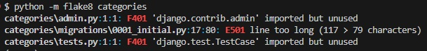

### Comments

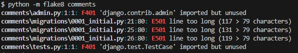

### Followers

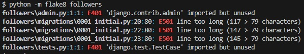

### Hacks

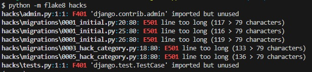

### Profiles

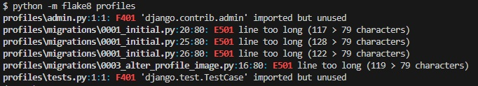

### Ratings

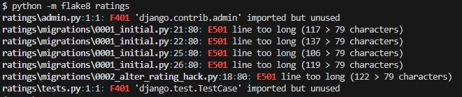

---

## **DEPLOYMENT**

## GitHub

### Visual Studio Code connection
* To deploy the code to GitHub, I used Visual Studio Code to connect to my GitHub account.

**Important**: Due to the accidental login with my secondary account in the bash console, DominikW89 was used for all VS Code deployments. Once I noticed this, I did not want to change it to avoid confusion.

 

### Commit and Push to GitHub
* Once the change was made, I pushed the code to GitHub via the VS Code menu. A message needs to be entered for each deployment.

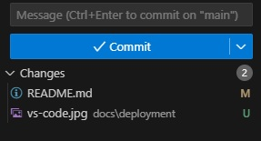

## Heroku

### Create a new project
* On the dashboard, select the menu to create a new Heroku project.

 

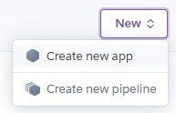

### Naming and region
* Give the app a proper name and select the region the application will be hosted in. For me, I chose Europe.

 

### Config Vars
* To keep your information private, head to the settings page and scroll down to config vars. Here, you can enter important and private information like the database url, the secret key and more.

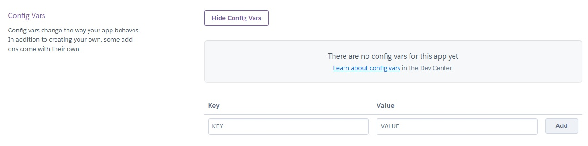

 

### GitHub connection
* Once your config vars are setup, click on the deploy page. There, you need to connect your current GitHub project to your Heroku account. Enter the name and link it.

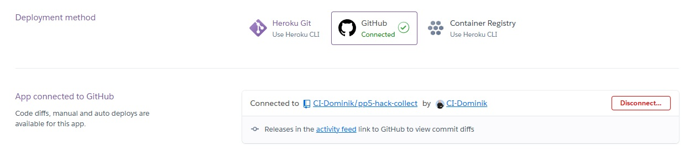

### Deployment
* When everything is connected successfully, click on deploy to deploy your selected GitHub branch.

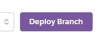

 

### Successful deployment
* When everything worked correctly, a success message will be displayed and a link to the hosted app will appear.

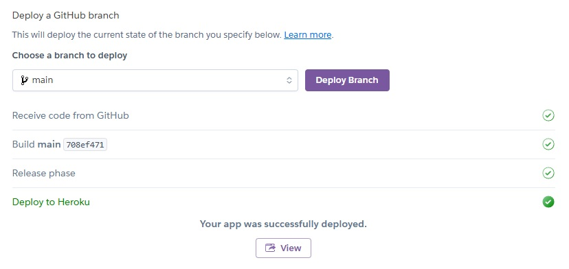

---

## **CREDITS**

## [Flake8 Extension](https://flake8.pycqa.org/en/latest/)
* Used to verify Python code.

## [YouTube](https://youtube.com)
* Videos for understanding some code areas.

## [Visual Studio Code](https://code.visualstudio.com/)
* Used to generate HTML boilerplate code and code editing.

## Special thanks
* A special thank you to my mentor Gareth McGirr who helped me along my journey and also to my best friend Frederic, who provided me with helpful insights and assisted me with many testing scenarios.